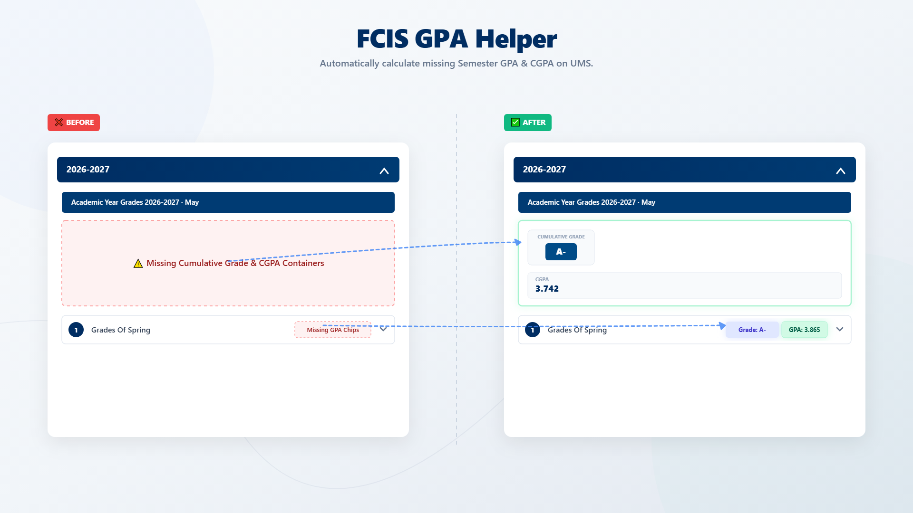

# FCIS GPA Helper 🎓

**FCIS GPA Helper** is a lightweight Chrome extension built for **Faculty of Computers and Information Sciences (FCIS), Ain Shams University** students.

The extension automatically detects missing **Semester GPA** and **Cumulative GPA (CGPA)** values on the UMS Student Grades page, calculates them locally, and displays them using the native UMS interface.

No configuration or user interaction is required.

---

## ✨ Features

- 🎯 Automatically calculates missing **Semester GPA**.
- 🎯 Automatically calculates missing **Cumulative GPA (CGPA)**.
- 🎯 Preserves existing GPA/CGPA values provided by the university system.
- 🎯 Supports both **Arabic** and **English** UMS interfaces natively.
- 🎯 Correctly handles repeated/improved courses by considering only the latest attempt.
- 🎯 Built-in **Update Notification System** to alert you when a new manual release is available on GitHub.
- 🎯 Secure and private: Runs locally inside your browser with no tracking or data collection.

---

## 📸 Interface Preview (Before vs After)



---

## 📁 Project Structure

```text
FCIS GPA Helper/
├── assets/
│   └── icons/
├── manifest.json
└── src/
    ├── constants.js
    ├── parser.js
    ├── calculator.js
    ├── renderer.js
    ├── updater.js
    └── index.js

```

### File Responsibilities

| File | Responsibility |
| --- | --- |
| `constants.js` | Grade mappings, dynamic thresholds, and shared language dictionaries |
| `parser.js` | Scrapes and extracts structural academic data from the UMS page |
| `calculator.js` | Mathematical utilities for calculating Semester GPA and CGPA |
| `renderer.js` | Injects calculated metric chips and hero containers into the page |
| `updater.js` | Performs secure semantic version comparisons against the upstream repository |
| `index.js` | Coordinates the full extension automation workflow lifecycle |

---

## ⚙️ How It Works

The extension follows this sequential flow layout:

```text
UMS Student Grades Page
        │
        ▼
Parse HTML (Single-pass)
        │
        ▼
Extract Semesters & Courses
        │
        ▼
Sort Chronologically (Oldest -> Newest)
        │
        ▼
Calculate Semester GPA
        │
        ▼
Update Repeated Courses (Latest attempt replaces older one)
        │
        ▼
Calculate CGPA
        │
        ▼
Render Missing Values & UI Blocks
        │
        ▼
Check for Extension Updates (Via GitHub raw manifest check)

```

---

## 📊 Grade Scale

The extension utilizes the official faculty credit-hour grading regulations:

| Grade | Points |
| --- | --- |
| A+ / A | 4.0 |
| A- | 3.7 |
| B+ | 3.3 |
| B | 3.0 |
| B- | 2.7 |
| C+ | 2.3 |
| C | 2.0 |
| C- | 1.7 |
| D+ | 1.3 |
| D | 1.0 |
| Fail | 0.0 |

---

## 🔄 Update Notifications

Since this extension is distributed manually via GitHub and not listed on the Chrome Web Store, it features a custom **Update Checker**.

On every page load, it securely fetches a tiny raw `version.json` file directly from GitHub. If a newer semantic version exists (e.g., `v1.1.0` > `v1.0.3`), it displays a clean, native-looking notification banner showing the new version's changelog in your current language with a one-click button to download the update.

---

## 🚀 Chrome Installation

1. Download or clone this repository.
2. Open Google Chrome and navigate to:

```text
chrome://extensions

```

3. Enable **Developer mode** using the toggle switch in the top-right corner.
4. Click the **Load unpacked** button in the top-left.
5. Select the project root folder.
6. Open or refresh the UMS **Student Grades** page.

---

## 🦊 Firefox Installation

FCIS GPA Helper is also compatible with Mozilla Firefox.

### Temporary Installation (Development)

1. Open Firefox and navigate to:

```text
about:debugging#/runtime/this-firefox
```

2. Click **Load Temporary Add-on**.
3. Select the extension's `manifest.json` file from the project folder.
4. Open or refresh the UMS **Student Grades** page.

> **Note:** Temporary add-ons are removed when Firefox is closed. For permanent installation, the extension should be distributed through the Firefox Add-ons (AMO) store once published.

---

## 🔒 Privacy

FCIS GPA Helper is designed with privacy as a foundational principle.

* No account or login required.
* No analytics trackers or tracking scripts.
* No third-party data collection.
* No database or cloud storage.
* The **only** network request made is a secure `fetch()` to GitHub's raw server to check for extension updates.

All GPA computations and grade evaluations are performed locally inside your sandbox context.

---

## 🎯 Supported Page

```text
https://ums.asu.edu.eg/StudentGrades
```

---

## 📄 License

This project is intended for educational purposes and to improve the student digital experience for FCIS Ain Shams University students.